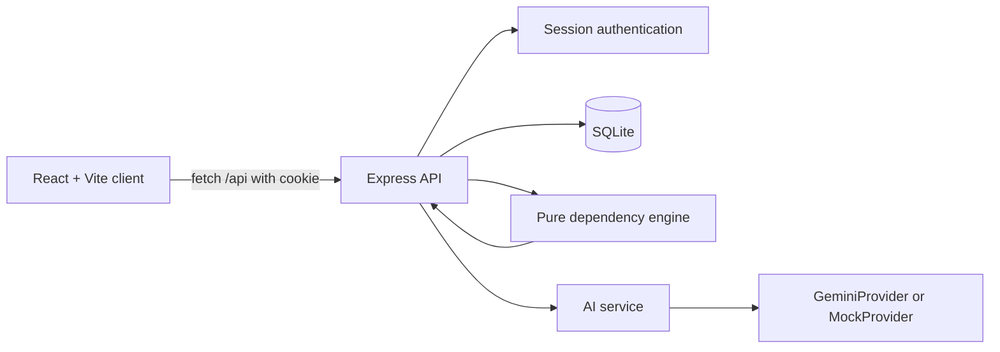

# TaskFlow Pro Design

## Architecture

The browser owns presentation and optimistic interaction state. Vite serves the React client in development and proxies `/api` to Express. The API owns authentication, request validation, transactions, persistence, dependency mutations, schedule propagation, and AI suggestion validation.

The server-side engine is split into graph traversal, dependency validation, blocked-status computation, movement rules, and schedule propagation. It accepts maps and arrays and returns values; it has no database, HTTP, filesystem, clock, or provider access. Keeping I/O outside the engine makes cycle, status, traversal, schedule, and performance behavior deterministic and directly unit-testable.

The AI service builds a grounded prompt from one target task, the other tasks, and current dependencies. A provider returns text; the service parses and validates it, then the API returns accepted and rejected suggestions. The client never receives the Gemini key.

Authentication uses an opaque random token in an `httpOnly`, `SameSite=Lax` cookie. Only its SHA-256 hash is stored in `sessions`; write routes and `GET /api/auth/me` require a live session. `GET /api/board` is public.

## Data Model

Migrations are applied in order through `schema_migrations`.

### `tasks`

| Column | Constraint / meaning |
| --- | --- |
| `id` | `TEXT PRIMARY KEY`. |
| `title` | Required task title. |
| `description` | Required text with a default empty string. |
| `status` | Required; `backlog`, `in_progress`, `review`, or `done`. |
| `position` | Required integer used for ordering within a status column. |
| `start_date`, `end_date` | Required ISO calendar dates. API validation rejects an end before a start. |
| `created_at`, `updated_at` | Required ISO timestamps. |

Index: `tasks_status_position_idx(status, position)`.

### `dependencies`

| Column | Constraint / meaning |
| --- | --- |
| `task_id` | Required foreign key to `tasks(id)`, cascades on task deletion. |
| `depends_on_id` | Required foreign key to `tasks(id)`, cascades on task deletion. |
| Primary key | Composite `(task_id, depends_on_id)` prevents duplicate edges. |
| Check | `task_id != depends_on_id` prevents self-edges at the database layer. |

Indexes: `dependencies_task_id_idx(task_id)` and `dependencies_depends_on_id_idx(depends_on_id)`. Semantically, `task_id -> depends_on_id` means the first task cannot proceed until the second is Done.

### `users`

| Column | Constraint / meaning |
| --- | --- |
| `id` | `TEXT PRIMARY KEY`. |
| `email` | Required and `UNIQUE`. |
| `password_hash` | Required bcrypt hash; plaintext passwords are not stored or returned. |
| `created_at` | Required creation timestamp. |

### `sessions`

| Column | Constraint / meaning |
| --- | --- |
| `token_hash` | `TEXT PRIMARY KEY`; SHA-256 hash of the opaque cookie token. |
| `user_id` | Required foreign key to `users(id)`, cascades on user deletion. |
| `expires_at` | Required session expiration timestamp. |
| `created_at` | Required creation timestamp. |

Indexes: `sessions_user_id_idx(user_id)` and `sessions_expires_at_idx(expires_at)`.

### `audit_log`

| Column | Constraint / meaning |
| --- | --- |
| `id` | `INTEGER PRIMARY KEY AUTOINCREMENT`. |
| `ts` | Required event timestamp. |
| `action` | Required event name such as `task.created` or `dependency.created`. |
| `payload` | JSON column with a default empty object. |

## Known Limitations

- The design supports one team and one board; there is no workspace, role, or multi-tenant authorization model.
- The target workload is a few hundred tasks. Graph status is computed in memory and the client loads the full board.
- Schedule propagation is push-only and finish-to-start. It moves downstream work later and preserves duration; it does not pull work earlier.
- Dependency edges have no type, lag, calendar, or cross-board semantics.
- The client is a Vite React application rather than the Next.js application described in the original synopsis. This matches the current Express API and keeps the standalone client build small.
- AI suggestions depend on Gemini availability and model output. The mock provider is for local UI work, not the demo. The cache is in memory and only stores the last result for one unchanged graph.
- Login throttling is in memory, so multiple API processes do not share attempt counts.
